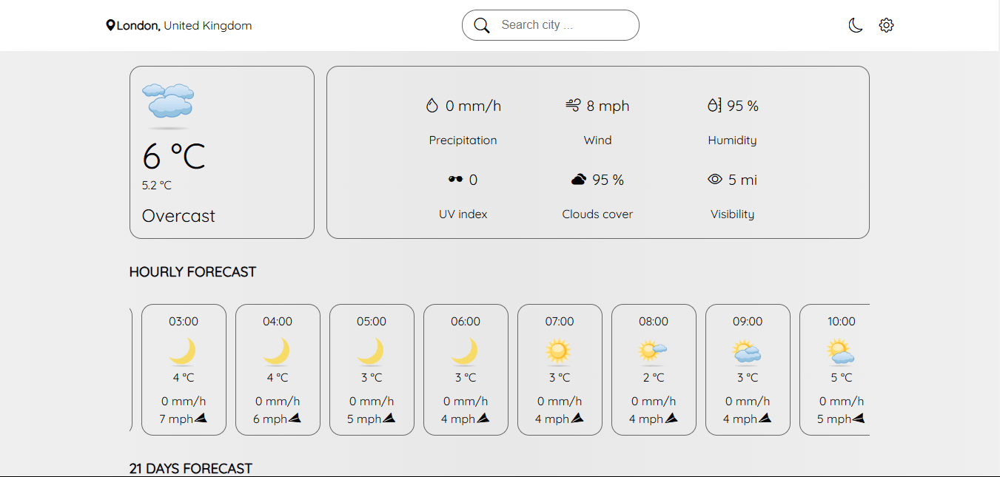
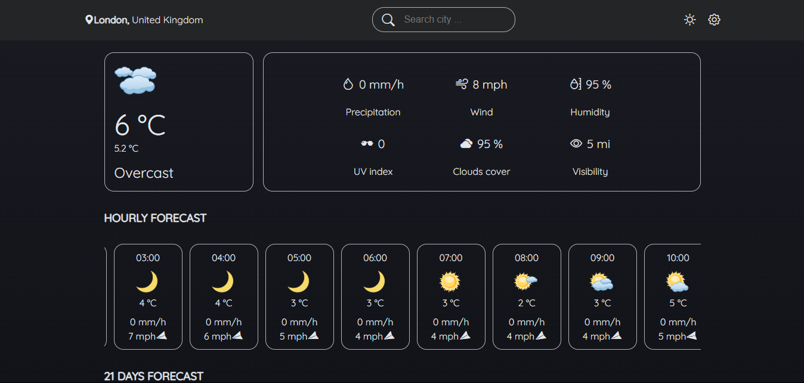

# ReactJS Weather App

Welcome to the React Weather App project! we will create a weather app using ReactJS and the Meteosource Weather API.

<table>
    <tr>
        <td>
            
        </td>
        <td>
            
        </td>
    </tr>
</table>

## Table of Contents

- [Overview](#overview)
- [Features](#features)
- [Getting Started](#getting-started)
- [Prerequisites](#prerequisites)
- [Usage](#usage)
- [Dependencies](#dependencies)
- [API Reference](#api-reference)
- [Contributing](#contributing)
- [License](#license)

## Overview

This project is a simple weather application built with React. It fetches weather data from the Meteosource Weather API and displays it in a user-friendly interface. This project aims to demonstrate how to integrate third-party APIs with React and how to build a complete application from scratch.

## Features

- Fetch and display current weather data for any location
- User-friendly interface with styled-components
- Responsive design
- Error handling for API requests

## Getting Started

Follow these instructions to get a copy of the project up and running on your local machine for development and testing purposes.

### Prerequisites

- Node.js (v14 or higher)
- pnpm (v6 or higher)

1. Clone the repository:
    ```sh
    git clone https://github.com/yourusername/reactjs-weather-app.git
    cd react-weather-app
    ```

2. Install the dependencies:
    ```sh
    pnpm install
    # or
    pnpm i
    ```

3. Create a `.env` file in the root directory and add your Meteosource API key:
    ```env
    VITE_REACT_APP_WEATHER_API_KEY=your_api_key_here
    ```

### Usage

1. Start the development server:
    `pnpm dev`

2. Open [http://localhost:3000](http://localhost:3000) to view it in the browser.

## Dependencies

This project uses the following dependencies:

- **axios**: A promise-based HTTP client for making requests to the Meteosource Weather API. It simplifies the process of handling HTTP requests and responses.
- **bootstrap-icons**: A library of free, high-quality icons designed for Bootstrap, but usable in any project. These icons enhance the visual appeal and user experience of the app.

## API Reference

This project uses the Meteosource Weather API to fetch weather data. You can find more information and sign up for an API key at the [Meteosource Weather API page](https://rapidapi.com/MeteosourceWeather/api/ai-weather-by-meteosource).

## Contributing

Contributions are welcome! Please feel free to submit a Pull Request.

1. Fork the repository.
2. Create your feature branch: `git checkout -b feature/my-new-feature`.
3. Commit your changes: `git commit -m 'Add some feature'`.
4. Push to the branch: `git push origin feature/my-new-feature`.
5. Submit a pull request.

## License

This project is licensed under the MIT License. See the [LICENSE](LICENSE) file for more details.